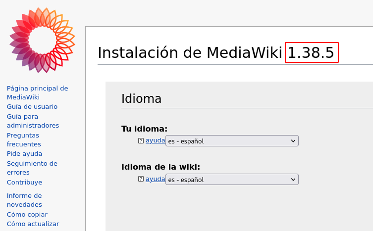
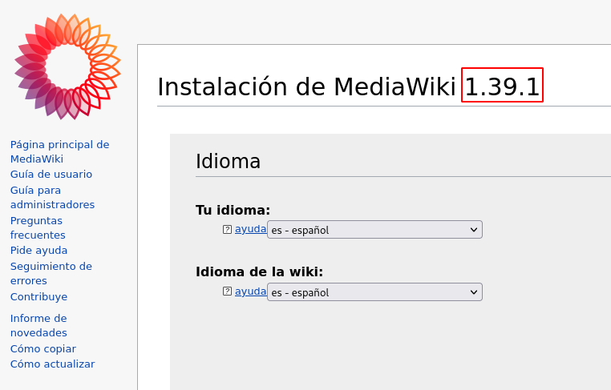

# Actualización de un Deployment (*rollout* y *rollback*)

El ciclo de vida del desarrollo de aplicaciones cuando trabajamos con contenedores nos facilita la labor de versionar nuestros desarrollos. Por cada nueva versión que se desarrolla de nuestra aplicación podemos crear una nueva imagen del contenedor que podemos versionar utilizando la etiqueta del nombre de la imagen.

Por lo tanto, al crear un Deployment indicaremos la imagen desde la que se van a crear los Pods. Al indicar la imagen podremos indicar la etiqueta que nos indica la versión de la aplicación que vamos a implantar.

Una vez que hemos creado un Deployment a partir de una imagen de una versión determinada, tenemos los Pods ejecutando la versión indicada de la aplicación.

¿Cómo podemos actualizar a una nueva versión de la aplicación?. Se seguirán los siguientes pasos:

1. Tendremos que modificar el valor del parámetro `image` para indicar una nueva imagen, especificando la nueva versión mediante el cambio de etiqueta.
2. En ese momento el Deployment se actualiza, es decir, crea un nuevo ReplicaSet que creará nuevos Pods de la nueva versión de la aplicación.
3. Según la estrategia de despliegue indicada, se irán borrando los antiguos Pods y se crearán lo nuevos.
4. El Deployment guardará el ReplicaSet antiguo, por si en algún momento queremos volver a la versión anterior.

Veamos este proceso con más detalles estudiando un ejemplo de despliegue:

## Desplegando la aplicación mediawiki

Vamos a partir del fichero  [`mediawiki-deployment.yaml`](files/mediawiki-deployment.yaml) para desplegar la aplicación:

```yaml
apiVersion: apps/v1
kind: Deployment
metadata:
  name: mediawiki
  labels:
    app: mediawiki
spec:
  replicas: 1
  selector:
    matchLabels:
      app: mediawiki
  template:
    metadata:
      labels:
        app: mediawiki
    spec:
      containers:
      - name: contenedor-mediawiki
        image: mediawiki:1.38.5
        ports:
        - containerPort: 80
```
Si nos fijamos vamos a desplegar la versión 1.38.5 de la aplicación mediawiki. Creamos el despliegue con la siguiente instrucción:

    kubectl apply -f mediawiki-deployment.yaml

A continuación podemos "anotar" en el despliegue la causa del nuevo despliegue, de esta forma al visualizar el historial de modificaciones veremos las causas que han provocado cada actualización. Para ello:

    kubectl annotate deployment/mediawiki kubernetes.io/change-cause="Primer despliegue. Desplegamos versión 1.38.5"

Podemos comprobar los recursos que hemos creado:

    kubectl get all

Y si accedemos al Pod con un `port-forward` comprobamos que la versión actual de la mediawiki es la 1.38.5:

    kubectl port-forward deployment/mediawiki 8080:80



## Actualizar un Deployment

A continuación queremos desplegar una versión más reciente de la mediawiki. Para ello tenemos que modificar el campo `image` de nuestro Deployment, esta operación la podemos hacer de varias formas:

1. Modificando el fichero yaml y volviendo a ejecutar un `kubectl apply`.
2. Ejecutando la siguiente instrucción:

        kubectl set image deployment/mediawiki contenedor-mediawiki=mediawiki:1.39.1

Al ejecutar la actualización del Deployment podemos observar que se ha creado un nuevo ReplicaSet, que creará los nuevos Pods a partir de la versión modificada de la imagen. ¿Cómo se crean los nuevos Pods y se destruyen los antiguos? Dependerá de la estrategia de despliegue:

  * Por defecto la estrategia de despliegue es `Recreate` que elimina los Pods antiguos y crea los nuevos.
  * Si indicamos en el despliegue el tipo de estrategia  `RollingUpdate`, se van creando los nuevos Pods, se comprueba que funcionan y se eliminan los antiguos.

A continuación indicamos el motivo del cambio del despliegue con una anotación:

    kubectl annotate deployment/mediawiki kubernetes.io/change-cause="Segundo despliegue. Actualizamos a la versión 1.39.1"

Veamos los recursos que se han creado en la actualización:

    kubectl get all

Kubernetes utiliza el término *rollout* para la gestión de diferentes versiones de despliegues. Podemos ver el historial de actualizaciones que hemos hecho sobre el despliegue:

    kubectl rollout history deployment/mediawiki

Y nos aparecen las anotaciones que hemos hecho de cada despliegue:

    deployment.apps/mediawiki 
    REVISION  CHANGE-CAUSE
    1         Primer despliegue. Desplegamos versión 1.38.5
    2         Segundo despliegue. Actualizamos a la versión 1.39.1


Y volvemos a acceder a la aplicación con un `port-forward` para comprobar que realmente se ha desplegado la versión 1.39.1.



## *Rollback* del Deployment

El proceso de despliegue de una nueva versión de una aplicación es una labor crítica, que tradicionalmente ha dado muchos problemas. Si estamos sirviendo una aplicación web que utilizan muchos usuarios, no nos podemos permitir que haya un corte en el servicio por un problema en el despliegue de una nueva versión.

Evidentemente, los problemas que pueden aparecer durante el despliegue de una nueva versión pueden estar causados por muchos motivos, y muchas veces es complicado tener todos los factores controlados. Si finalmente tenemos alguno, la pregunta sería: ¿Hemos diseñado un proceso que nos permita de una manera sencilla y rápida volver a la versión anterior de la aplicación que sabíamos que funcionaba bien?

A ese proceso de volver a una versión anterior de la aplicación es lo que llamamos **rollback**, o de forma concreta en k8s, "deshacer" un **rollout**. Veremos en este ejemplo que Kubernetes nos ofrece un mecanismo sencillo de volver a versiones anteriores. Como hemos comentado, las actualizaciones de los Deployment van creando nuevos ReplicaSet, y se va guardando el historial de ReplicaSet anteriores. Deshacer un Rollout será tan sencillo como activar uno de los ReplicaSet antiguos.

Ahora vamos a desplegar una versión que nos da un error (la versión 2 de la aplicación no existe, no existe la imagen `mediawiki:2`). ¿Podremos volver al despliegue anterior?

    kubectl set image deployment mediawiki contenedor-mediawiki=mediawiki:2

Y realizamos la anotación:

    kubectl annotate deployment/mediawiki kubernetes.io/change-cause="Tercer despliegue. Actualizamos a la versión 2"

Comprobamos el historial de despliegues:

```
kubectl rollout history deployment/mediawiki
deployment.apps/mediawiki 
REVISION  CHANGE-CAUSE
1         Primer despliegue. Desplegamos versión 1.38.5
2         Segundo despliegue. Actualizamos a la versión 1.39.1
3         Tercer despliegue. Actualizamos a la versión 2
```

Dependiendo de la estrategia de despliegue, esto puede provocar que la aplicación se quede en la versión anterior (`RollingUpdate`) o que no haya ningún Pod válido desplegado (`Recreate`). En cualquier caso, se puede volver a la versión anterior del despliegue mediante rollout:

    kubectl rollout undo deployment/mediawiki
    kubectl get all

Y terminamos comprobando el historial de actualizaciones:

```
kubectl rollout history deployment mediawiki
deployment.apps/mediawiki
REVISION  CHANGE-CAUSE
1         Primer despliegue. Desplegamos versión 1.38.5
3         Tercer despliegue. Actualizamos a la versión 2
4         Segundo despliegue. Actualizamos a la versión 1.39.1
```

## Vídeo

[https://www.youtube.com/watch?v=6LjTwopWDFw](https://www.youtube.com/watch?v=6LjTwopWDFw)
